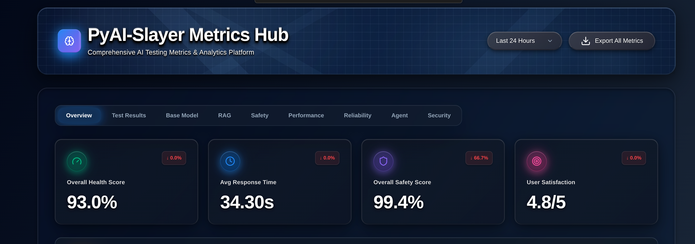
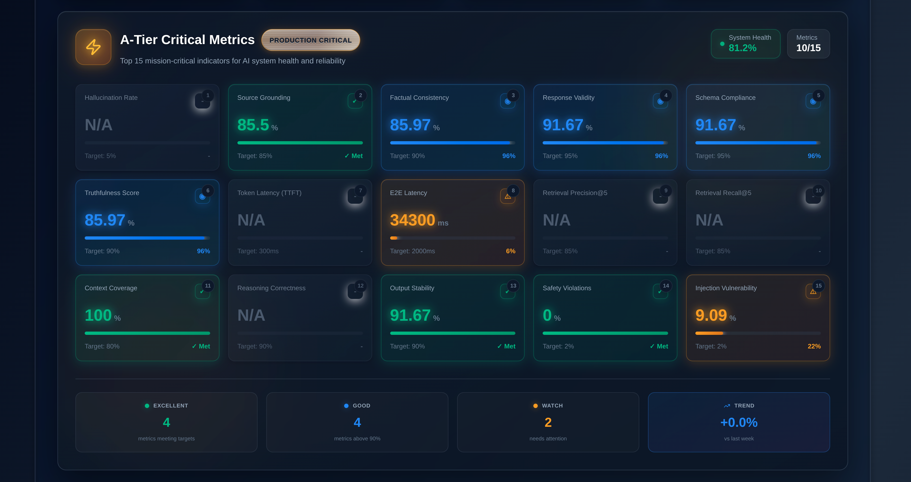
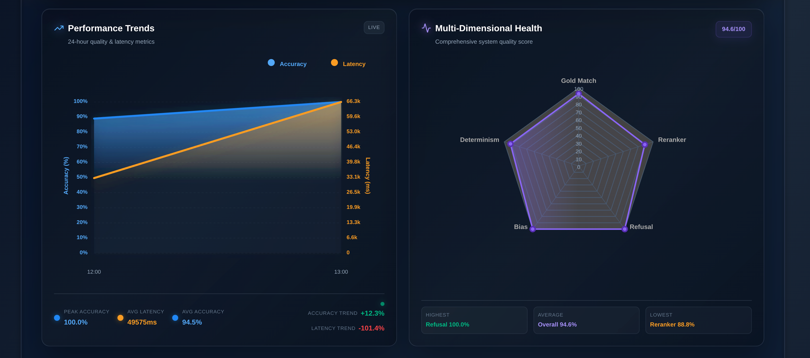
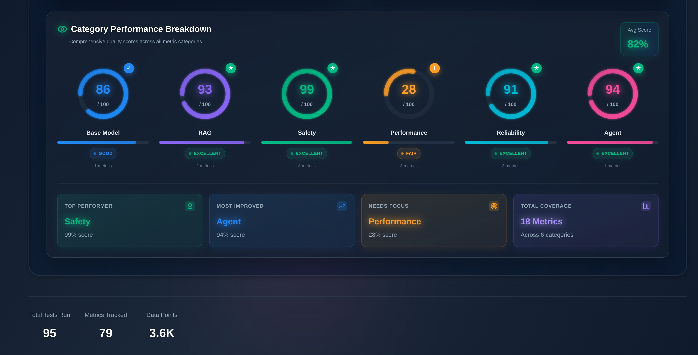

# PyAI-Slayer 🗡️⚡

**The Open Source AI Testing Arsenal**

A comprehensive Python automation framework for testing AI chatbots and LLM applications with semantic validation, multilingual support, and real-time observability.

[](https://www.python.org/downloads/)
[](https://opensource.org/licenses/MIT)

## ✨ Key Features

- 🤖 **AI Response Validation** - Semantic similarity, hallucination detection, consistency checking
- 🌍 **Multilingual Support** - English & Arabic with RTL/LTR layout validation
- 🔒 **Security Testing** - Injection attacks, prompt injection, input sanitization
- 📊 **Real-Time Dashboard** - Live metrics, A-Tier critical indicators, performance analytics
- 🎭 **Browser Automation** - Desktop & mobile testing with Playwright
- ♿ **Accessibility** - ARIA labels, keyboard navigation, screen reader compatibility

## 🚀 Quick Start

### Installation

```bash
# Clone the repository
git clone https://github.com/yourusername/PyAI-Slayer.git
cd PyAI-Slayer

# Install system dependencies (Linux/Ubuntu)
sudo apt-get update && sudo apt-get install -y git wget gnupg fonts-liberation libasound2 \
    libatk-bridge2.0-0 libatk1.0-0 libcups2 libdbus-1-3 libdrm2 libgbm1 libgtk-3-0 \
    libnspr4 libnss3 libxcomposite1 libxdamage1 libxfixes3 libxkbcommon0 libxrandr2

# Setup (installs dependencies & browsers)
make setup

# Configure environment
cp .env.example .env
# Edit .env with your settings (CHATBOT_URL, etc.)
```

### Run Tests

```bash
# Run all tests
make test

# Run specific category
make test-base-model
make test-rag
make test-safety

# Run with dashboard
make test-with-dashboard
```

### Launch Dashboard

```bash
make dashboard
# Access at http://localhost:8080
```

## 📸 Dashboard Showcase

### Overview - Key Metrics at a Glance



Real-time tracking of Overall Health Score, Average Response Time, Safety Score, and User Satisfaction.

---

### A-Tier Critical Metrics



15 production-critical AI capability indicators including Source Grounding, Factual Consistency, E2E Latency, and Safety Violations.

---

### Performance Trends & Multi-Dimensional Health



24-hour quality & latency metrics with comprehensive radar chart showing system health across 5 dimensions.

---

### Category Performance Breakdown



Complete quality scores across Base Model, RAG, Safety, Performance, Reliability, and Agent categories.

---

## 🧪 Test Categories

| Category | Tests | Focus Area |
|----------|-------|------------|
| **Base Model** | Basic functionality, response quality, error handling | Core chatbot capabilities |
| **RAG** | Context retrieval, source attribution, grounding | Retrieval-Augmented Generation |
| **Safety** | Harmful content, bias detection, refusal | Safety & ethics compliance |
| **Performance** | Response time, throughput, resource usage | Speed & efficiency |
| **Reliability** | Consistency, determinism, error recovery | Stability & predictability |
| **Security** | Injection attacks, prompt manipulation | Security vulnerabilities |
| **Agent** | Multi-turn conversations, tool usage | Advanced capabilities |

## 📊 Reporting Features

- **Real-Time Metrics** - Live test execution monitoring
- **A-Tier Indicators** - 15 production-critical metrics with target tracking
- **Historical Trends** - Time-series analysis (24h, 7d, 30d)
- **Failed Test Analysis** - Detailed breakdowns with recommendations
- **Category Performance** - Quality scores across 6 categories
- **Export Capabilities** - JSON, HTML, and Prometheus metrics

## 🛠️ Common Commands

```bash
# Development
make setup              # Install dependencies
make test              # Run all tests
make test-watch        # Run tests on file changes
make dashboard         # Launch dashboard

# Quality Checks
make check             # Run linters
make format            # Format code
make type-check        # Run type checking

# Metrics & Analysis
make metrics-summary   # View metrics summary
make metrics-export    # Export to JSON

# Docker
make docker-build      # Build container
make docker-test       # Run tests in container
make docker-dashboard  # Run dashboard in container

# Cleanup
make clean             # Remove artifacts
```

## 📁 Project Structure

```
PyAI-Slayer/
├── src/
│   ├── dashboard/          # Real-time dashboard & API
│   ├── validators/         # AI response validators
│   └── utils/             # Utilities & helpers
├── tests/
│   ├── base_model/        # Base model tests
│   ├── rag/              # RAG tests
│   ├── safety/           # Safety tests
│   └── pages/            # Page objects
├── configs/              # Test configurations
├── docs/                 # Documentation
└── scripts/             # Utility scripts
```

## 🔧 Configuration

Key environment variables in `.env`:

```env
# Target Application
CHATBOT_URL=http://localhost:3000
CHATBOT_API_URL=http://localhost:8000

# AI Models
EMBEDDING_MODEL=sentence-transformers/all-MiniLM-L6-v2
LLM_MODEL=gpt-4

# Dashboard
DASHBOARD_PORT=8080
ENABLE_PROMETHEUS_METRICS=true

# Testing
HEADLESS=true
BROWSER=chromium
```

See [docs/CONFIGURATION.md](docs/CONFIGURATION.md) for complete options.

## 📚 Documentation

- [Getting Started Guide](docs/getting_started.rst) - Detailed setup & usage
- [Dashboard Guide](docs/DASHBOARD.md) - Dashboard features & metrics
- [Framework Architecture](docs/FRAMEWORK_ARCHITECTURE.md) - Design & patterns
- [Metrics Calculations](docs/METRICS_CALCULATIONS.md) - How metrics are computed
- [Docker Guide](docs/DOCKER.md) - Container usage
- [API Reference](docs/api_reference.rst) - Code documentation

## 🐳 Docker Quick Start

```bash
# Build and run
make docker-build
make docker-test

# Or use docker-compose
docker-compose up --build
```

## 🤝 Contributing

Contributions welcome! Please check out our [Contributing Guide](CONTRIBUTING.md).

```bash
# Setup development environment
make setup

# Run tests before committing
make check
make test

# Format code
make format
```

## 📄 License

MIT License - see [LICENSE](LICENSE) file for details.

## 🙏 Acknowledgments

Built with amazing open-source tools:
- [Playwright](https://playwright.dev/) - Browser automation
- [sentence-transformers](https://www.sbert.net/) - Semantic similarity
- [Pydantic](https://pydantic-docs.helpmanual.io/) - Data validation
- [FastAPI](https://fastapi.tiangolo.com/) - Dashboard API
- [Loguru](https://github.com/Delgan/loguru) - Logging

---

⭐ **Star this repo** if you find it useful! | 🐛 **Report issues** on GitHub | 💬 **Join discussions**
