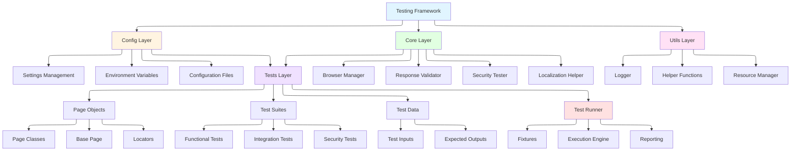

# Testing Framework Architecture & How It Works

## 🏗️ High-Level Architecture



## 🧠 Core Layer - Deep Dive

The Core Layer is the heart of the testing framework, providing essential services and abstractions that enable test execution. It acts as a bridge between the configuration layer and the test layer, offering reusable components that handle complex operations.

### Core Layer Components

#### 1. **Browser Manager**
**Purpose:** Manages browser lifecycle and provides abstraction over browser automation tools.

**Responsibilities:**
- Browser instance creation and destruction
- Context management (isolated browser sessions)
- Page creation and management
- Browser configuration (headless mode, viewport, user agents)
- Network interception and request/response handling
- Cookie and storage management

**Key Features:**
- Supports multiple browsers (Chromium, Firefox, WebKit)
- Context isolation for parallel test execution
- Automatic resource cleanup
- Browser-specific configuration management

**Design Pattern:** Singleton/Factory pattern to ensure single browser instance per test session.

#### 2. **Response Validator**
**Purpose:** Validates application responses using various validation strategies.

**Responsibilities:**
- Semantic similarity validation (using NLP/ML models)
- Response structure validation (schema validation)
- Content quality assessment
- Cross-language validation
- Consistency checking across multiple responses

**Validation Strategies:**
- **Semantic Validation:** Uses embedding models to compare query-response similarity
- **Schema Validation:** Validates response structure against expected schemas
- **Content Validation:** Checks for required information, completeness, and accuracy
- **Performance Validation:** Measures response time and validates against SLAs

**Key Features:**
- Configurable similarity thresholds
- Support for multiple languages
- Caching of validation results
- Extensible validation rules

#### 3. **Security Tester**
**Purpose:** Automated security testing and vulnerability detection.

**Responsibilities:**
- Input sanitization validation
- Injection attack testing (XSS, SQL, Command, Prompt Injection)
- Security header validation
- Authentication and authorization testing
- Data leakage detection

**Security Test Categories:**
- **Input Validation:** Tests for proper sanitization of user inputs
- **Injection Attacks:** Tests for various injection vulnerabilities
- **Authentication:** Tests for authentication bypass attempts
- **Authorization:** Tests for privilege escalation and access control
- **Data Protection:** Tests for sensitive data exposure

**Key Features:**
- Predefined payload libraries
- Custom payload support
- Automated payload generation
- Security report generation

#### 4. **Localization Helper**
**Purpose:** Handles multi-language and internationalization testing.

**Responsibilities:**
- Text direction detection (LTR/RTL)
- Language-specific validation
- Locale-specific formatting validation
- Character encoding handling
- Translation consistency checking

**Key Features:**
- Support for bidirectional text
- Locale-aware assertions
- Language detection
- Character set validation

### Core Layer Design Principles

1. **Separation of Concerns:** Each component has a single, well-defined responsibility
2. **Dependency Injection:** Components are loosely coupled and can be easily replaced
3. **Extensibility:** New validators or testers can be added without modifying existing code
4. **Configuration-Driven:** Behavior is controlled through configuration, not code changes
5. **Resource Management:** Automatic cleanup and resource management to prevent leaks

### Core Layer Integration

The Core Layer components are designed to work independently or together:

```
Test Execution
    │
    ├─> Browser Manager (provides browser context)
    │       │
    │       └─> Page Objects (use browser context)
    │
    ├─> Response Validator (validates responses)
    │       │
    │       └─> Uses semantic models, schemas
    │
    ├─> Security Tester (validates security)
    │       │
    │       └─> Uses payload libraries
    │
    └─> Localization Helper (handles i18n)
            │
            └─> Provides locale-aware utilities
```

## 📋 Test Layer - Test Segregation Strategy

The Test Layer is organized using a segregation strategy that separates tests by their purpose, scope, and execution characteristics. This organization improves maintainability, enables selective test execution, and makes the test suite more understandable.

### Test Segregation Principles

#### 1. **By Test Type**

Tests are segregated based on what they validate:

- **Functional Tests:** Validate application functionality and business logic
  - User workflows and use cases
  - Feature-specific behavior
  - Business rule validation

- **Integration Tests:** Validate interactions between components
  - API integrations
  - Service-to-service communication
  - End-to-end workflows

- **Security Tests:** Validate security aspects
  - Input sanitization
  - Authentication and authorization
  - Vulnerability testing

- **Performance Tests:** Validate performance characteristics
  - Response time validation
  - Load testing
  - Resource usage monitoring

#### 2. **By Test Scope**

Tests are organized by the scope of what they test:

- **Unit-level Tests:** Test individual components in isolation
- **Component Tests:** Test groups of related components
- **System Tests:** Test the entire system end-to-end
- **Acceptance Tests:** Test from user perspective

#### 3. **By Execution Characteristics**

Tests are grouped by how and when they should run:

- **Smoke Tests:** Critical path tests that run on every commit
- **Regression Tests:** Comprehensive tests that run on scheduled intervals
- **Sanity Tests:** Quick validation tests for specific features
- **Full Suite:** Complete test coverage for releases

### Test Organization Structure

```
tests/
├── e2e/                 # End-to-end tests
│   ├── ai/            # AI validation tests
│   │   ├── test_gpt_english.py
│   │   ├── test_gpt_arabic.py
│   │   ├── test_rag_metrics.py
│   │   ├── test_hallucination_detection.py
│   │   └── ...
│   ├── security/      # Security tests
│   │   ├── test_input_sanitization.py
│   │   ├── test_prompt_injection.py
│   │   └── test_security_resilience.py
│   └── ui/            # UI tests
│       ├── test_chat_ui_desktop.py
│       ├── test_chat_ui_mobile.py
│       └── test_accessibility.py
│
├── integration/        # Integration tests
│   └── ui/            # UI integration tests
│
├── unit/               # Unit tests
│   ├── test_ai_validator.py
│   ├── test_browser_manager.py
│   ├── test_security_tester.py
│   └── ...
│
├── pages/              # Page Object Model
│   ├── base_page.py
│   ├── chat_page.py
│   ├── login_page.py
│   └── locators.py
│
└── test_data/          # Test data
    ├── prompts/        # Test prompts (EN/AR)
    └── expected/      # Expected response schemas
```

### Test Segregation Benefits

1. **Selective Execution:** Run specific test categories based on need
   ```bash
   pytest tests/e2e/ai/            # Run only AI validation tests
   pytest tests/e2e/security/      # Run only security tests
   pytest tests/e2e/ui/            # Run only UI tests
   pytest -m smoke                  # Run smoke tests
   ```

2. **Parallel Execution:** Different test types can run in parallel
   - Functional tests in one process
   - Security tests in another
   - Performance tests separately

3. **Maintainability:** Easy to locate and update related tests
   - All security tests in one place
   - All functional tests together
   - Clear ownership and responsibility

4. **CI/CD Integration:** Different test suites for different pipeline stages
   - Smoke tests in pre-commit hooks
   - Full suite in nightly builds
   - Security tests in security scans

5. **Resource Management:** Different test types may need different resources
   - Performance tests may need dedicated infrastructure
   - Security tests may need isolated environments
   - Functional tests can share resources

### Test Markers and Tags

Tests are further organized using markers/tags for fine-grained control:

```python
@pytest.mark.functional
@pytest.mark.smoke
def test_critical_user_flow():
    """Runs in smoke test suite"""
    pass

@pytest.mark.security
@pytest.mark.integration
def test_authentication_integration():
    """Runs in security and integration suites"""
    pass
```

### Test Data Segregation

Test data is also segregated to match test organization:

```
test_data/
├── functional/          # Data for functional tests
├── integration/         # Data for integration tests
├── security/            # Payloads and test vectors
└── performance/         # Load profiles and scenarios
```

This ensures:
- Test data is co-located with tests that use it
- Data can be versioned independently
- Data can be customized per test type
- Easier to maintain and update

## 🔄 Test Execution Flow

### 1. **Test Initialization**

```python
# When you run: pytest tests/e2e/ui/test_chat_ui_desktop.py

Step 1: Pytest loads conftest.py
  ├─ Creates fixtures (browser_manager, page, chat_page, etc.)
  ├─ Loads settings from src/config/settings.py
  │   └─ Reads .env file → Parses environment variables
  └─ Initializes AI validator, security tester

Step 2: For each test function
  ├─ Pytest injects fixtures (page, chat_page, etc.)
  ├─ setup_test fixture runs (navigates to base_url)
  └─ Test executes
```

### 2. **Example: UI Test Execution**

```python
# tests/e2e/ui/test_chat_ui_desktop.py
def test_chat_widget_loads(self, chat_page, page):
    # 1. Fixture injection: chat_page and page are provided by conftest.py
    #    - page: Playwright Page object (browser page)
    #    - chat_page: ChatPage object (our page object)

    # 2. Navigate to chatbot
    page.goto(settings.chat_url, wait_until="domcontentloaded")
    #    - settings.chat_url = "https://your-chatbot-url.example.com"
    #    - Loaded from src/config/settings.py → .env file

    # 3. Wait for chat widget
    is_loaded = chat_page.wait_for_chat_loaded()
    #    - chat_page.wait_for_chat_loaded() uses BasePage.wait_for_element()
    #    - Looks for MESSAGE_INPUT selector
    #    - Returns True when element is visible

    # 4. Assert
    assert is_loaded, "Chat widget failed to load"
```

## 🧩 Framework Components Explained

### 1. **Configuration System** (`src/config/`)

**Purpose:** Centralized configuration management using Pydantic

**How it works:**
```python
# src/config/settings.py
class Settings(BaseSettings):
    base_url: str = "https://example.com"
    api_url: str = "https://api.example.com"

    # Reads from .env file automatically
    username: str = ""
    password: str = ""
    test_timeout: int = 30

    model_config = {
        "env_file": ".env",  # Automatically loads .env
        "case_sensitive": False,  # BASE_URL = base_url
    }

# Global instance - imported everywhere
settings = Settings()
```

**Usage:**
```python
from config.settings import settings

# Access configuration
url = settings.base_url
timeout = settings.test_timeout
```

**Environment Variable Mapping:**
- `.env` file: `BASE_URL=https://example.com`
- Pydantic automatically converts to: `settings.base_url`

### 2. **Browser Manager** (`src/core/browser/browser_manager.py`)

**Purpose:** Manages browser lifecycle and provides abstraction over browser automation tools.

**How it works:**
```python
# Creates and manages browser lifecycle
class BrowserManager:
    def start(self):
        # 1. Start browser automation framework
        self.automation = sync_automation().start()

        # 2. Launch browser (chromium/firefox/webkit)
        self.browser = self.automation.chromium.launch(
            headless=settings.headless,
            viewport=settings.viewport
        )

        # 3. Create context (isolated browser session)
        self.context = self.browser.new_context(
            locale=settings.locale,
            timezone_id=settings.timezone
        )

        # 4. Create page (tab)
        self.page = self.context.new_page()

    def stop(self):
        # Cleanup resources
        self.page.close()
        self.context.close()
        self.browser.close()
        self.automation.stop()
```

**Usage in tests:**
```python
# conftest.py provides fixtures
@pytest.fixture
def browser_manager():
    manager = BrowserManager()
    manager.start()
    yield manager
    manager.stop()

@pytest.fixture
def page(browser_manager):
    page = browser_manager.context.new_page()
    yield page
    page.close()
```

### 3. **Page Object Model** (`tests/pages/`)

**Purpose:** Encapsulates UI interactions in reusable classes (part of test layer)

**How it works:**
```python
# tests/pages/base_page.py - Base class
class BasePage:
    def __init__(self, page):
        self.page = page  # Browser page object

    def click(self, selector: str):
        self.page.locator(selector).click()

    def fill(self, selector: str, text: str):
        self.page.locator(selector).fill(text)

    def wait_for_element(self, selector: str, timeout: int = 30):
        return self.page.locator(selector).wait_for(timeout=timeout)

# tests/pages/specific_page.py - Specific page
class SpecificPage(BasePage):
    # Define selectors once (via locators composition)
    locators = PageLocators()

    def perform_action(self, text: str):
        # 1. Fill input
        self.page.locator(self.locators.INPUT_FIELD).fill(text)

        # 2. Click submit
        self.page.locator(self.locators.SUBMIT_BUTTON).click()

        # 3. Wait for response
        self.wait_for_element(self.locators.RESPONSE_AREA)
```

**Benefits:**
- **Reusability:** Write page methods once, use everywhere
- **Maintainability:** If UI changes, update selectors in one place
- **Readability:** Tests read like documentation: `page.perform_action("data")`
- **Test Layer:** Page objects are part of the test layer, not core framework

### 4. **Response Validator** (`src/core/ai/ai_validator.py`)

**Purpose:** Validates application responses using various validation strategies

**How it works:**
```python
class ResponseValidator:
    def __init__(self):
        # Load pre-trained model for semantic validation
        self.semantic_model = SentenceTransformer('all-MiniLM-L6-v2')
        self.similarity_threshold = 0.7

    def validate_relevance(self, query: str, response: str):
        # 1. Convert text to vectors (embeddings)
        query_vector = self.semantic_model.encode(query)
        response_vector = self.semantic_model.encode(response)

        # 2. Calculate cosine similarity
        similarity = cosine_similarity(query_vector, response_vector)
        #    Returns 0.0 (unrelated) to 1.0 (identical)

        # 3. Check against threshold
        is_relevant = similarity >= self.similarity_threshold
        return is_relevant, similarity

    def validate_schema(self, response: dict, schema: dict):
        # Validate response structure against JSON schema
        return validate(response, schema)

    def validate_content(self, response: str, required_keywords: list):
        # Check if response contains required information
        return all(keyword in response.lower() for keyword in required_keywords)
```

**Example:**
```python
# Test: Is response relevant to the query?
query = "How do I perform an action?"
response = "To perform this action, follow these steps..."

is_relevant, score = validator.validate_relevance(query, response)
# score = 0.85 (85% similar) → is_relevant = True ✓
```

**Validation Strategies:**
- **Semantic Validation:** Uses embedding models to compare query-response similarity
- **Schema Validation:** Validates response structure against expected schemas
- **Content Validation:** Checks for required information, completeness, and accuracy
- **Cross-language Validation:** Validates responses in different languages are semantically equivalent

### 5. **Security Tester** (`src/core/security/security_tester.py`)

**Purpose:** Automated security testing and vulnerability detection

**How it works:**
```python
class SecurityTester:
    def __init__(self):
        # Loads payloads from test data files
        self.injection_payloads = {
            "xss": ["<script>alert('XSS')</script>", ...],
            "sql_injection": ["'; DROP TABLE users--", ...],
            "command_injection": ["; rm -rf /", ...],
            "path_traversal": ["../../../etc/passwd", ...]
        }

    def validate_input_sanitization(self, input_text, output_text):
        # Check if dangerous content was sanitized
        security_issues = []

        if "<script" in output_text.lower():
            security_issues.append("contains_script_tags")
        if "javascript:" in output_text.lower():
            security_issues.append("contains_javascript_protocol")

        return {
            "is_sanitized": len(security_issues) == 0,
            "issues": security_issues
        }

    def test_injection_attack(self, payload_type: str, input_field):
        # Test specific injection attack type
        payloads = self.injection_payloads.get(payload_type, [])
        results = []

        for payload in payloads:
            result = self._test_payload(payload, input_field)
            results.append(result)

        return results
```

**Example Test:**
```python
# tests/security/test_input_sanitization.py
def test_xss_injection_sanitized(self, page, security_tester):
    # 1. Navigate to application
    page.goto(settings.base_url)

    # 2. Send XSS payload
    xss_payload = "<script>alert('XSS')</script>"
    page.fill("#input-field", xss_payload)
    page.click("#submit-button")

    # 3. Get response
    response = page.locator("#response-area").text_content()

    # 4. Validate it was sanitized
    result = security_tester.validate_input_sanitization(
        xss_payload, response
    )
    assert result["is_sanitized"], f"Security issues: {result['issues']}"
```

**Security Test Categories:**
- **Input Validation:** Tests for proper sanitization of user inputs
- **Injection Attacks:** Tests for various injection vulnerabilities (XSS, SQL, Command, etc.)
- **Authentication:** Tests for authentication bypass attempts
- **Authorization:** Tests for privilege escalation and access control
- **Data Protection:** Tests for sensitive data exposure

## 📊 Complete Test Flow Example

Let's trace a complete test execution:

```python
# Test: tests/e2e/ai/test_gpt_english.py::test_basic_query_response

1. Pytest starts
   └─> Loads conftest.py
       └─> Creates fixtures

2. Test function called
   def test_basic_query_response(self, chat_page, page, ai_validator):

3. Fixtures injected
   ├─> page: Playwright Page (browser tab)
   ├─> chat_page: ChatPage object (wraps page)
   └─> ai_validator: AIResponseValidator (loaded once per session)

4. Setup (from conftest.py)
   └─> page.goto(settings.base_url)
       └─> Navigates to your configured chatbot URL

5. Test execution
   ├─> query = "How do I renew my residence visa?"
   ├─> start_time = time.time()  # Start timer
   │
   ├─> chat_page.send_message(query, wait_for_response=True)
   │   ├─> chat_page.page.locator(MESSAGE_INPUT).fill(query)
   │   ├─> chat_page.page.locator(SEND_BUTTON).click()
   │   └─> chat_page.wait_for_ai_response()
   │       └─> Waits for AI_RESPONSE element to appear
   │
   ├─> response = chat_page.get_latest_response()
   │   └─> Extracts text from last AI message
   │
   ├─> response_time = time.time() - start_time
   │   └─> Calculate: 2.5 seconds
   │
   ├─> Assertions
   │   ├─> assert response is not None
   │   ├─> assert len(response) > 0
   │   ├─> assert response_time < 180  # Performance check
   │   │
   │   └─> is_relevant, similarity = ai_validator.validate_relevance(
   │           query, response
   │       )
   │       ├─> Encodes query and response to vectors
   │       ├─> Calculates cosine similarity: 0.82
   │       └─> is_relevant = True (0.82 > 0.7 threshold)
   │
   └─> assert is_relevant  # ✓ Test passes

6. Cleanup
   └─> Screenshot on failure (if test failed)
   └─> Close page
```

## 🎯 Key Design Patterns

### 1. **Fixture Pattern** (Pytest)

```python
# conftest.py
@pytest.fixture
def chat_page(page):
    """Creates ChatPage object for each test."""
    return ChatPage(page)

# Usage in test
def test_something(chat_page, page):
    # chat_page is automatically created and injected
    chat_page.send_message("Hello")
```

**Benefits:**
- **DRY:** Don't repeat `ChatPage(page)` in every test
- **Consistency:** Same setup for all tests
- **Cleanup:** Automatic cleanup after test

### 2. **Page Object Pattern**

```python
# Instead of this (bad):
page.locator("input[type='text']").fill("Hello")
page.locator("button:has-text('Send')").click()

# Do this (good):
chat_page.send_message("Hello")
```

**Benefits:**
- **Abstraction:** Hide complex selectors
- **Maintainability:** Change selector in one place
- **Readability:** Tests read like documentation

### 3. **Configuration Pattern** (Pydantic Settings)

```python
# Single source of truth
settings = Settings()  # Loads from .env

# Use everywhere
url = settings.base_url
timeout = settings.test_timeout
```

**Benefits:**
- **Environment-specific:** Different .env for dev/staging/prod
- **Type-safe:** Pydantic validates types
- **Auto-loading:** No manual file reading

## 🔧 How to Use the Framework

### 1. **Write a Simple UI Test**

```python
# tests/e2e/ui/test_my_feature.py
import pytest
from tests.pages.chat_page import ChatPage
from config.settings import settings

@pytest.mark.ui
class TestMyFeature:
    def test_send_message(self, chat_page, page):
        # Navigate
        page.goto(settings.chat_url)

        # Wait for chat
        chat_page.wait_for_chat_loaded()

        # Send message (using chatbot name from settings)
        greeting = f"Hello, {settings.chatbot_name}!"
        chat_page.send_message(greeting)

        # Get response
        response = chat_page.get_latest_response()

        # Assert
        assert response is not None
        assert len(response) > 0
```

### 2. **Write an AI Validation Test**

```python
# tests/e2e/ai/test_my_ai.py
import pytest
from tests.pages.chat_page import ChatPage
from core.ai.ai_validator import AIResponseValidator

@pytest.mark.ai
class TestMyAI:
    @pytest.fixture(autouse=True)
    def setup(self):
        self.validator = AIResponseValidator()

    def test_response_relevance(self, chat_page, page):
        query = "What services does the government provide?"
        chat_page.send_message(query)
        response = chat_page.get_latest_response()

        # Validate relevance
        is_relevant, score = self.validator.validate_relevance(
            query, response
        )

        assert is_relevant, f"Response not relevant (score: {score:.2f})"
```

### 3. **Write a Security Test**

```python
# tests/e2e/security/test_my_security.py
import pytest
from tests.pages.chat_page import ChatPage
from core.security.security_tester import SecurityTester

@pytest.mark.security
class TestMySecurity:
    @pytest.fixture(autouse=True)
    def setup(self):
        self.security = SecurityTester()

    def test_xss_protection(self, chat_page, page):
        xss_payload = "<script>alert('XSS')</script>"
        chat_page.send_message(xss_payload)
        response = chat_page.get_latest_response()

        # Check sanitization
        result = self.security.validate_input_sanitization(
            xss_payload, response
        )

        assert result["is_sanitized"], "XSS not properly sanitized"
```

## 🚀 Running Tests

### Test Commands:

The framework provides several test targets:

- **`make test`** - Runs all e2e tests (AI, security, UI - excludes unit tests)
  - Executes: `pytest tests/e2e/ai/ tests/e2e/security/ tests/e2e/ui/`
- **`make test-ai`** - Runs AI validation tests only
  - Executes: `pytest tests/e2e/ai/`
- **`make test-security`** - Runs security tests only
  - Executes: `pytest tests/e2e/security/`
- **`make test-ui`** - Runs UI tests only
  - Executes: `pytest tests/e2e/ui/`
- **`make test-unit`** - Runs unit tests only
  - Executes: `pytest tests/unit/`
- **`make test-all`** - Runs all tests (unit + e2e)
  - Executes: `pytest tests/`
- **`make test-cov`** - Runs all tests with coverage reporting
- **`make check`** - Runs linting and type checking only (no tests)
- **`make ci`** - Runs CI pipeline (lint + type-check + unit tests)

### Command Flow:

```bash
make test
  │
  ├─> Makefile: test target
  │   └─> $(VENV_BIN)/pytest tests/e2e/ai/ tests/e2e/security/ tests/e2e/ui/ -n 5 -vv -s
  │
  ├─> Pytest starts
  │   ├─> Reads pyproject.toml for config
  │   ├─> Loads conftest.py (fixtures)
  │   └─> Discovers tests in specified directories
  │
  ├─> For each test:
  │   ├─> Creates fixtures (page, chat_page, etc.)
  │   ├─> Runs setup_test (navigates to URL)
  │   ├─> Executes test function
  │   └─> Runs cleanup
  │
  └─> Generates reports
      ├─> HTML report: reports/report.html
      ├─> JSON report: reports/report.json
```

## 📁 File Organization

```
PyAI-Slayer/
├── src/                      # Framework source code (core layer)
│   ├── config/
│   │   ├── settings.py          # Pydantic settings (reads .env)
│   │   ├── environments.yaml    # Multi-env configs
│   │   └── feature_flags.py     # Feature flags
│   │
│   ├── core/                     # Core framework logic
│   │   ├── ai/                   # AI validation
│   │   │   ├── ai_validator.py      # AI response validation
│   │   │   ├── rag_tester.py        # RAG testing
│   │   │   ├── hallucination_detector.py
│   │   │   └── conversation_tester.py
│   │   ├── browser/              # Browser automation
│   │   │   ├── browser_manager.py   # Playwright wrapper
│   │   │   └── browser_pool.py     # Browser pool management
│   │   ├── infrastructure/         # Infrastructure components
│   │   │   ├── cache.py
│   │   │   ├── circuit_breaker.py
│   │   │   ├── retry.py
│   │   │   └── ...
│   │   ├── observability/         # Observability features
│   │   │   ├── prometheus_metrics.py
│   │   │   └── playwright_tracing.py
│   │   ├── security/             # Security testing
│   │   │   ├── security_tester.py
│   │   │   └── prompt_injection_tester.py
│   │   └── validation/          # Validation strategies
│   │       ├── localization_helper.py # RTL/LTR handling
│   │       └── validation_strategy.py
│   │
│   ├── dashboard/               # Dashboard application
│   │   ├── api.py
│   │   ├── collectors.py
│   │   ├── metrics_calculator.py  # Backward-compatible wrapper
│   │   ├── metrics_engine.py      # Central orchestration
│   │   ├── metrics_spec.py        # Metric specifications
│   │   ├── metric_validator.py    # Metric validation
│   │   └── calculators/           # Modular metric calculators
│   │       ├── base_model.py      # Base model metrics
│   │       ├── rag.py             # RAG metrics
│   │       ├── safety.py          # Safety metrics
│   │       ├── performance.py     # Performance metrics
│   │       ├── reliability.py     # Reliability metrics
│   │       ├── agent.py           # Agent metrics
│   │       ├── security.py        # Security metrics
│   │       └── detectors.py      # Heavy dependencies (lazy-loaded)
│   │   └── ...
│   │
│   └── utils/                    # Utilities
│       ├── logger.py            # Logging setup
│       ├── helpers.py           # Helper functions
│       ├── screenshot_manager.py # Screenshot handling
│       └── report_generator.py
│
└── tests/                    # Test layer (AI chatbot tests)
    ├── conftest.py          # Pytest fixtures
    │
    ├── e2e/                  # End-to-end tests
    │   ├── ai/               # AI validation test suites
    │   ├── security/         # Security test suites
    │   └── ui/               # UI test suites
    │
    ├── integration/         # Integration tests
    │
    ├── unit/                 # Unit tests
    │
    ├── pages/                # Page Object Model (part of test layer)
    │   ├── base_page.py         # Base class
    │   ├── chat_page.py         # Chat interface
    │   ├── login_page.py        # Login interface
    │   ├── locators.py          # Selector definitions
    │   └── mixins.py            # Reusable mixins
    │
    └── test_data/            # Test data (part of test layer)
        ├── prompts/              # Test prompts (EN/AR)
        └── expected/             # Expected response schemas
```

## 🎓 Key Concepts Summary

1. **Core Layer:** Provides essential services (Browser Manager, Response Validator, Security Tester, Localization Helper)
2. **Configuration Layer:** Centralized configuration management from environment variables and config files
3. **Test Segregation:** Tests organized by type, scope, and execution characteristics for better maintainability
4. **Page Objects:** Encapsulate UI interactions (part of test layer)
5. **Fixtures:** Reusable test setup (browser, pages, validators)
6. **Response Validation:** Multiple validation strategies (semantic, schema, content)
7. **Security Testing:** Automated vulnerability detection and input sanitization testing
8. **Test Markers:** Organize and selectively execute tests by category
9. **Separation of Concerns:** Clear separation between framework (`src/`) and tests (`tests/`)

## 💡 Best Practices

1. **Leverage Core Layer:** Use framework components for complex operations
2. **Use Page Objects:** Don't write selectors directly in tests
3. **Use Fixtures:** Don't create objects manually, leverage dependency injection
4. **Use Settings:** Don't hardcode URLs/credentials, use configuration
5. **Segregate Tests:** Organize tests by type and purpose for better maintainability
6. **Use Markers:** Tag tests appropriately for selective execution
7. **Use Assertions:** Validate both UI and application responses
8. **Use Logging:** Add appropriate logging for debugging and traceability

This framework provides a complete testing solution with UI automation, response validation, security testing, and proper test organization!
